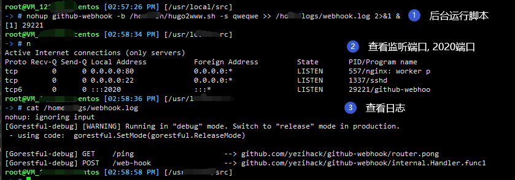

# 1. Github-webhook Tools

[](https://travis-ci.org/yezihack/github-webhook)
[](https://github.com/yezihack/github-webhook/releases)
[](https://github.com/yezihack/github-webhook/blob/master/LICENSE)


<!-- TOC -->

- [1. Github-webhook Tools](#1-github-webhook-tools)
  - [1.1. 📡 Overview](#11--overview)
  - [1.2. 📜 Usage](#12--usage)
    - [1.2.1. Download && Install](#121-download--install)
  - [1.3. Command](#13-command)
    - [1.3.1. Use Systemd](#131-use-systemd)
  - [1.4. WebHook](#14-webhook)
  - [1.5. 💌 Features](#15--features)
  - [1.6. How it works](#16-how-it-works)
  - [1.7. 👋 Thanks](#17--thanks)

<!-- /TOC -->
## 1.1. 📡 Overview

- The Github-webhook is a webhook tool on github
- That can trigger bash scripts after monitoring git's push behavior
- The a line command handles the automatic build
- Built-in queue for tasks, quick response to GitHub Webhook, 100% response 200 guaranteed

1. github-webhook 是github webhook自动构建工具.能监听git push行为,自动触发脚本.
1. 一条命令搞定webhook自动构建,无需复杂的配置.
1. 内置队列执行任务，迅速响应 github webhook, 保证100% response 200

## 1.2. 📜 Usage

### 1.2.1. Download && Install

- [releases](https://github.com/yezihack/github-webhook/releases)
  
```shell script
cd ~
wget https://github.com/yezihack/github-webhook/releases/download/v1.5.0/github-webhook1.5.0.linux-amd64.tar.gz
tar -zxvf github-webhook1.5.0.linux-amd64.tar.gz
cp ~/github-webhook /usr/sbin
chmod +x /usr/sbin/github-webhook
```

run script

```sh
mkdir -p /opt/sh

cat > /opt/sh/test.sh <<EOF
#!/bin/bash

now=\$(date)
echo "date:\${now}"
EOF

/usr/sbin/github-webhook --bash /opt/sh/test.sh
```

## 1.3. Command

- Daemonize run:  `nohup github-webhook --bash /home/my.sh --secret mysecret -q &`  后台运行
- Monitor run: `github-webhook --bash /home/my.sh --secret mysecret`
- Quiet mode run: `github-webhook --bash /home/my.sh --secret mysecret --quiet`
- Custom port mode run: `github-webhook --bash /home/my.sh --secret mysecret --port 6100 --quiet`
- Hidden secret mode run: `github-webhook --bash /home/my.sh  --quiet`

### 1.3.1. Use Systemd

> `/opt/sh/test.sh` is your script bash file

```shell script
cat > /usr/lib/systemd/system/webhook.service << EOF
[Unit]
Description=github-webhook
Documentation=https://github.com/yezihack/github-webhook
After=network.target
 
[Service]
Type=simple
ExecStart=/usr/bin/github-webhook --bash /home/sh/hugo2www.sh --secret qweqwe
Restart=always
RestartSec=3s
 
[Install]
WantedBy=multi-user.target
EOF
```

**Manager Systemd:**

```shell script
systemctl daemon-reload
systemctl start webhook
systemctl status webhook
```

## 1.4. WebHook

- Default port: 2020
- Http path: /web-hook
- Test URL: `http://ip:2020/ping`
- WebHook URL: `http://ip:2020/web-hook`

## 1.5. 💌 Features

- Just run the binaries file
- Custom your bash script
- Custom your enter secret
- Custom your port. 0 ~ 65535
- Quiet operation

中文

- 直接运行二进制文件
- 自定义脚本路径
- 自定义密码
- 自定义端口. 0 ~ 65535
- 安静模式

```text
GLOBAL OPTIONS:
   --bash value, -b value    Execute the script path. eg: /home/hook.sh
   --port value, -p value    http port (default: 2020)
   --secret value, -s value  github hook secret
   --quiet, -q               quiet operation (default: false)
   --verbose, --vv           print verbose (default: false)
   --help, -h                show help (default: false)
   --version, -v             print the version (default: false)
```

中文

```text
GLOBAL OPTIONS:
   --bash value, -b value    Execute the script path. eg: /home/hook.sh 自定义脚本
   --port value, -p value    http port (default: 2020) 自定义端口,默认6666
   --secret value, -s value  github hook secret 自定义密码, 不允许为空
   --verbose, --vv           print verbose (default: false) 打印更多详细信息
   --quiet, -q               quiet operation (default: false) 安静模式,默认关闭. -q 开启,不输出任何信息
   --help, -h                show help (default: false) 
   --version, -v             print the version (default: false)

```

## 1.6. How it works


- step 1:: Run your github-webhook server

  - notice: port default 2020, http-path: /web-hook
  - 注意: 端口默认为 2020, 可以更改, http的路由: /web-hook
  - 查看自己的外网Ip: `curp ip.sb`

  

- step 2: Add webhook
  - 添加 webhook 参数

    
    
    

- step 3: run shell script
- notice: Make sure that the last line write: exit 0
- shell脚本的最后一行一定要写上 `exit 0` 代码

```bash
#!/bin/bash
echo "hello webhook"
exit 0
```

## 1.7. 👋 Thanks

- See [GitbookIO](https://github.com/GitbookIO/go-github-webhook)
